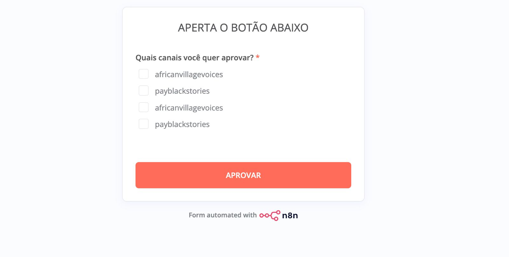

E aí qual que é o problema que a gente tá enfrentando nesse fluxo aí? Que vale a pena nós olharmos. Que eu acho que não vai ter problema quando a gente transmutar, né? A lógica tá passando mais de vídeo de uma vez pra seleção.

Ele está fazendo Enfim, ele está fazendo Many to many, uma relação Many to many errada Não sei o que está acontecendo não, mas Posso te mandar uns prints Do que está dando errado E você infere aí de alguma forma Do porquê que isso está acontecendo Que eu não faço ideia, estamos juntos

---------

Aí, olha, eu estou clicando, eu escolho vídeo de cada vez para poder multiplicar, concorda? Isso é uma decisão unitária, individual, é para muitos, tá? Aqui é para muitos, por quê? Posso ter vídeo, eu selecionei 15 vídeos, mas eu vou dizer qual vídeo vai para qual canal, a Então eu cliquei num vídeo específico com benchmark video ID único e vou falar.

Aí ele já está me mostrando para quais canais você quer transmutar ou aprovar esse vídeo, mandar para a produção. Aí, olha como ele duplicou, ele falou duas vezes os mesmos canais elegíveis. Ele identificou dois canais elegíveis, beleza. Agora ele duplicou ali, por quê?

Porque tem outro vídeo na fila também para produzir. O que não tem nada a ver. Concorda? Não deveria ter nada a ver. Eu estou olhando para vídeo específico e eu quero escolher os canais.

Por que diabos a lista de canais está duplicada? Não faço ideia. A minha inferência, a minha opinião é que porque tem mais de vídeo que passou. Agora você imagina o tamanho do problema. Nós vamos colocar 15 vídeos