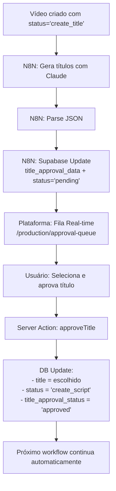

# 🔖 CHECKPOINT - Sistema de Aprovação de Títulos

**Data:** 2025-11-23
**Status:** Backend 100% Completo | Frontend Aguardando Design Figma

---

## 📦 RESUMO EXECUTIVO

Sistema para substituir aprovação de títulos por email (N8N → Gmail) por uma fila real-time na plataforma web.

**Fluxo Implementado:**
```
N8N gera títulos → Salva no DB → Fila real-time → Usuário aprova → Avança workflow
```

---

## ✅ O QUE FOI IMPLEMENTADO

### 1. Migration de Banco de Dados
**Arquivo:** `supabase/migrations/20251123_add_title_approval_system.sql`

**Colunas adicionadas em `production_videos`:**
- `title_approval_data` (JSONB) - Dados dos títulos gerados pelo Claude
- `title_approval_status` (TEXT) - Status: 'pending' | 'approved'
- `title_approved_at` (TIMESTAMPTZ) - Timestamp de aprovação
- `title_approved_by` (TEXT) - Identificador do aprovador (futuro)

**Índice criado:**
```sql
CREATE INDEX idx_title_approval_pending
ON production_videos(title_approval_status, created_at)
WHERE title_approval_status = 'pending' AND status = 'create_title';
```

**Formato do JSONB (VALIDADO COM GOBBI):**
```json
{
  "title": "On Father's Day, My CEO Son Asked...",
  "alternatives": [
    { "text": "At My Retirement Party...", "score": "6/7" },
    { "text": "On My 70th Birthday...", "score": "6/7" },
    { "text": "At Thanksgiving...", "score": "7/7" }
    // ... 10 alternativas no total
  ],
  "analysis": {
    "emotional": null,
    "rationale": "6/7 Fidelity Score"
  },
  "original": {
    "formula": null
  },
  "benchmark_title": null,
  "generated_at": "2025-11-23T14:10:55.382Z"
}
```

**⚠️ Importante:** Cada alternativa tem campo `score` (string, formato "X/7")

---

### 2. Server Actions (Backend API)
**Arquivo:** `app/(dashboard)/production/approval-queue/actions.ts`

**Funções implementadas:**

#### a) `approveTitle(videoId, selectedTitle)`
Aprova um título e avança o workflow.

**Fluxo:**
1. Valida se vídeo está em `status='create_title'` e `title_approval_status='pending'`
2. Atualiza campo `title` com título escolhido
3. Marca `title_approval_status='approved'` com timestamp
4. **Avança status para `'create_script'`** (próxima etapa)
5. Revalida página

**Retorno:**
```typescript
{ success: boolean, error?: string, videoId?: number }
```

#### b) `getPendingTitleApprovals()`
Busca fila de aprovações pendentes.

**Critérios:**
- `status = 'create_title'`
- `title_approval_status = 'pending'`
- Ordenado por `created_at ASC` (mais antigos primeiro)
- Limite: 50 vídeos
- Inclui JOIN com `benchmark_videos` para contexto

**Retorno:** Array de `PendingApproval[]`

#### c) `getApprovalQueueStats()`
Estatísticas para badges/contadores na navegação.

**Retorno:**
```typescript
{ pendingCount: number }
```

#### d) `validateTitleApprovalData(data)`
Helper para validar estrutura do JSONB.

Valida:
- `title` existe e é string
- `alternatives` é array com pelo menos 1 item
- Cada alternativa tem `text` e `score` (strings)

---

### 3. Types TypeScript

**Interface completa (validada com formato real do Gobbi):**

```typescript
interface TitleApprovalData {
  title: string
  alternatives: Array<{ text: string; score: string }>
  analysis?: {
    emotional?: string | null
    rationale?: string | null
  }
  original?: {
    formula?: string | null
  }
  benchmark_title?: string | null
  generated_at?: string
}

interface PendingApproval {
  id: number
  title_approval_data: TitleApprovalData
  title_approval_status: string | null
  created_at: string
  benchmark_id: number | null
  benchmark_videos?: {
    id: number
    title: string
    thumbnail_url: string | null
  } | null
}

interface ApproveTitleResult {
  success: boolean
  error?: string
  videoId?: number
}
```

---

### 4. Documentação Completa

#### a) `n8n-integration-guide.md`
Guia passo a passo de integração com N8N:
- Como modificar workflow (remover email, adicionar Supabase Update)
- Configuração exata do node Supabase
- Estrutura do JSON com formato real validado
- Testes e troubleshooting

#### b) `README.md`
Resumo executivo com:
- Lista de arquivos criados
- Fluxo completo (diagrama)
- Estrutura do JSONB documentada
- Queries SQL úteis prontas
- Checklist de implementação
- Seção de troubleshooting

---

## 🔧 INTEGRAÇÃO N8N (IMPLEMENTADA PELO GOBBI)

**Status:** ✅ Testado e funcionando

**Mudança no workflow:**

**ANTES:**
```
[Parse JSON] → [Send Email] → [Wait for Response] → [Update DB]
```

**DEPOIS:**
```
[Parse JSON] → [Supabase Update Node] → ✅ FIM
```

**Configuração do Node Supabase:**
- Table: `production_videos`
- Update By: `id`
- Fields:
  - `title_approval_data`: JSON completo
  - `title_approval_status`: `"pending"`
  - `updated_at`: `now()`

**Formato validado:** O Gobbi confirmou que está enviando no formato com `score` nas alternativas.

---

## 🎯 PRÓXIMOS PASSOS

### ⏳ Aguardando (Não implementado ainda)

1. **Design do Figma**
   - Usuário vai enviar instruções de design
   - Implementar frontend baseado no design fornecido

2. **Frontend a ser criado:**
   - `app/(dashboard)/production/approval-queue/page.tsx` - Página principal
   - `app/(dashboard)/production/approval-queue/components/title-approval-queue.tsx` - Fila real-time
   - `app/(dashboard)/production/approval-queue/components/title-approval-card.tsx` - Card de aprovação

3. **Navegação:**
   - Adicionar link no sidebar: `/production/approval-queue`
   - Sugestão de nome: "Approval Queue" (não "Title Approval", pois terá outros tipos)

4. **Features do Frontend (planejadas):**
   - ✅ Realtime com Supabase subscriptions
   - ✅ Exibir score de cada alternativa
   - ✅ Destacar título sugerido
   - ✅ Lidar com campos null gracefully
   - ✅ Toast notifications (Sonner)
   - ✅ Optimistic updates

---

## 🧪 COMO TESTAR (Quando Frontend Estiver Pronto)

### 1. Aplicar Migration
```bash
cd automedia/
npx supabase db push
```

### 2. Validar Colunas
```sql
SELECT column_name, data_type
FROM information_schema.columns
WHERE table_name = 'production_videos'
  AND column_name LIKE 'title_approval%';
```

### 3. Verificar Títulos Pendentes
```sql
SELECT
  id,
  title_approval_status,
  title_approval_data->>'title' as suggested_title,
  jsonb_array_length(title_approval_data->'alternatives') as alternatives_count,
  created_at
FROM production_videos
WHERE title_approval_status = 'pending'
  AND status = 'create_title'
ORDER BY created_at DESC;
```

**Esperado:**
- `title_approval_status` = `'pending'`
- `alternatives_count` = `10`
- JSON válido em `title_approval_data`

### 4. Testar Aprovação (Manual via SQL)
```sql
UPDATE production_videos
SET
  title = 'Título escolhido',
  title_approval_status = 'approved',
  title_approved_at = NOW(),
  status = 'create_script',
  updated_at = NOW()
WHERE id = SEU_VIDEO_ID;
```

### 5. Testar via Server Action (quando frontend existir)
```typescript
import { approveTitle } from '@/app/(dashboard)/production/approval-queue/actions'

const result = await approveTitle(123, "Título escolhido")
console.log(result.success) // true
```

---

## 📂 ESTRUTURA DE ARQUIVOS

```
automedia/
├── supabase/migrations/
│   └── 20251123_add_title_approval_system.sql ✅
│
├── app/(dashboard)/production/approval-queue/
│   └── actions.ts ✅
│
└── docs/next-steps/tittle-approval/
    ├── README.md ✅
    ├── n8n-integration-guide.md ✅
    ├── CHECKPOINT.md ✅ (este arquivo)
    └── workflow-criação-de-tittles-com-claude-code.json (referência)
```

---

## 🐛 TROUBLESHOOTING RÁPIDO

| Problema | Solução |
|----------|---------|
| Migration não aplica | `npx supabase db reset && npx supabase db push` |
| Vídeo não aparece na fila | Verificar `status='create_title'` e `title_approval_status='pending'` |
| JSON inválido | Verificar formato com `score` em cada alternativa |
| Server Action erro | Checar logs Supabase e validar tipos TypeScript |

---

## 🔄 FLUXO COMPLETO END-TO-END



---

## 📝 NOTAS IMPORTANTES

1. **Status do Workflow:**
   - Ao aprovar, muda de `'create_title'` → `'create_script'`
   - Baseado no schema do banco do Gobbi

2. **Real-time:**
   - Supabase Realtime subscriptions
   - Múltiplos usuários veem mesma fila sincronizada

3. **Campos Nullable:**
   - `emotional`, `formula`, `benchmark_title` podem ser `null`
   - Frontend deve lidar com isso gracefully

4. **Score das Alternativas:**
   - Formato: "X/7" (string)
   - Frontend pode destacar 7/7 como melhor opção

5. **Autenticação:**
   - Campo `title_approved_by` existe mas está null
   - TODO: Integrar quando houver sistema de auth

---

## 🎨 FRONTEND - COMPONENTES PLANEJADOS (NÃO IMPLEMENTADO)

### Estrutura Planejada:

```typescript
// page.tsx (Server Component)
export default async function ApprovalQueuePage() {
  const pending = await getPendingTitleApprovals()
  return <TitleApprovalQueue initialData={pending} />
}

// title-approval-queue.tsx (Client Component com Realtime)
export function TitleApprovalQueue({ initialData }) {
  // Supabase Realtime subscription
  // Renderiza lista de TitleApprovalCard
}

// title-approval-card.tsx (Client Component)
export function TitleApprovalCard({ video }) {
  // RadioGroup com título sugerido + 10 alternativas
  // Mostra score de cada opção
  // Botão de aprovar chama approveTitle()
}
```

### Features Planejadas:
- ✅ Badge count no sidebar (usar `getApprovalQueueStats()`)
- ✅ Exibir thumbnail do benchmark
- ✅ Highlight no título sugerido
- ✅ Mostrar score em cada alternativa
- ✅ Timestamp de quando foi gerado
- ✅ Toast de sucesso/erro
- ✅ Otimistic UI updates
- ✅ Empty state quando não há pendências

---

## 💾 QUERIES SQL ÚTEIS

### Ver todos pendentes
```sql
SELECT * FROM production_videos
WHERE title_approval_status = 'pending'
  AND status = 'create_title'
ORDER BY created_at DESC;
```

### Ver alternativas de um vídeo
```sql
SELECT
  id,
  title_approval_data->'alternatives' as alternatives
FROM production_videos
WHERE id = SEU_VIDEO_ID;
```

### Limpar aprovações de teste
```sql
UPDATE production_videos
SET
  title_approval_status = NULL,
  title_approval_data = NULL,
  title_approved_at = NULL,
  title_approved_by = NULL
WHERE title_approval_status = 'approved';
```

---

## ✅ CHECKLIST DE STATUS

### Backend (Completo)
- [x] Migration criada e documentada
- [x] Server Actions implementadas
- [x] Types TypeScript definidos
- [x] Validação de dados implementada
- [x] Formato do JSON validado com Gobbi
- [x] Documentação completa (README + Guide)

### Integração N8N (Completo)
- [x] Workflow modificado pelo Gobbi
- [x] Node Supabase configurado
- [x] Teste realizado (JSON salvo corretamente)

### Frontend (Pendente)
- [ ] Aguardando instruções de design do Figma
- [ ] Página `/production/approval-queue`
- [ ] Componente de fila real-time
- [ ] Componente de card de aprovação
- [ ] Link no sidebar
- [ ] Testes end-to-end

---

## 🚀 COMO RETOMAR O PROJETO

Se você estourar o contexto e precisar retomar:

1. **Leia este arquivo primeiro** (CHECKPOINT.md)
2. **Revise o README.md** para estrutura geral
3. **Veja o actions.ts** para entender as APIs disponíveis
4. **Consulte o n8n-integration-guide.md** se precisar debugar N8N
5. **Implemente o frontend** seguindo as instruções do Figma quando fornecidas

**Tudo que você precisa saber está documentado!** 📚

---

**Última atualização:** 2025-11-23
**Próximo passo:** Aguardar instruções de design do Figma para implementar frontend
