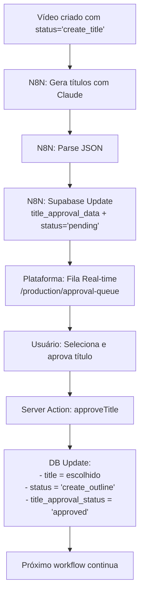

# Sistema de Aprovação de Títulos

**Status:** 🟡 Backend Implementado | Frontend Aguardando Design do Figma

---

## 📁 Arquivos Criados

### ✅ Backend (Completo)

1. **Migration**
   - 📄 `supabase/migrations/20251123_add_title_approval_system.sql`
   - Adiciona 4 colunas na tabela `production_videos`:
     - `title_approval_data` (JSONB) - Dados dos títulos gerados
     - `title_approval_status` (TEXT) - Status: `pending` | `approved`
     - `title_approved_at` (TIMESTAMPTZ) - Timestamp de aprovação
     - `title_approved_by` (TEXT) - Identificador do aprovador

2. **Server Actions**
   - 📄 `app/(dashboard)/production/approval-queue/actions.ts`
   - Funções disponíveis:
     - `approveTitle(videoId, selectedTitle)` - Aprova título e avança workflow
     - `getPendingTitleApprovals()` - Busca fila de aprovações
     - `getApprovalQueueStats()` - Estatísticas para badges/contadores
     - `validateTitleApprovalData(data)` - Helper de validação

3. **Documentação**
   - 📄 `docs/next-steps/tittle-approval/n8n-integration-guide.md`
   - Guia completo de integração com N8N

### ⏳ Frontend (Aguardando Figma)

Componentes planejados (aguardando instruções de design):
- 📄 `app/(dashboard)/production/approval-queue/page.tsx` - Página principal
- 📄 `app/(dashboard)/production/approval-queue/components/title-approval-queue.tsx` - Fila real-time
- 📄 `app/(dashboard)/production/approval-queue/components/title-approval-card.tsx` - Card de aprovação

---

## 🚀 Como Aplicar

### 1. Aplicar Migration no Banco do Gobbi

```bash
cd automedia/
npx supabase db push
```

**Validar:**
```sql
SELECT column_name, data_type
FROM information_schema.columns
WHERE table_name = 'production_videos'
  AND column_name LIKE 'title_approval%';
```

### 2. Modificar Workflow N8N

Consulte o guia detalhado: [`n8n-integration-guide.md`](./n8n-integration-guide.md)

**Resumo:**
- **Remover:** Nodes de "Send Email" e "Wait for Response"
- **Adicionar:** Node Supabase Update
- **Configurar:** Atualizar `production_videos` com `title_approval_data` e `title_approval_status = 'pending'`

### 3. Testar Integração

```sql
-- Verificar títulos pendentes
SELECT
  id,
  title_approval_status,
  title_approval_data->>'title' as suggested_title,
  jsonb_array_length(title_approval_data->'alternatives') as alternatives_count,
  created_at
FROM production_videos
WHERE title_approval_status = 'pending'
ORDER BY created_at DESC;
```

---

## 🔄 Fluxo Completo



---

## 📊 Estrutura do JSONB

### Campo: `title_approval_data`

**Formato real enviado pelo N8N:**

```json
{
  "title": "On Father's Day, My CEO Son Asked, \"Dad, Do You Like The $8000 Marcus Sends You?\"",
  "alternatives": [
    { "text": "At My Retirement Party, My VP Son Asked, \"Dad, Who Paid Your $6000 Medical Bills?\"", "score": "6/7" },
    { "text": "On My 70th Birthday, My Executive Son Said, \"Dad, Wasn't It Nice of Derek to Fix Your Roof?\"", "score": "6/7" },
    { "text": "At Thanksgiving, My Director Son Asked, \"Dad, Do You Appreciate The $7500 Kevin Gives You?\"", "score": "7/7" },
    { "text": "On Father's Day, My Manager Son Asked, \"Dad, Aren't You Grateful For What Brian Does?\"", "score": "5/7" }
    // ... mais 6 alternativas (total de 10)
  ],
  "analysis": {
    "emotional": null,
    "rationale": "6/7 Fidelity Score"
  },
  "original": {
    "formula": null
  },
  "benchmark_title": null,
  "generated_at": "2025-11-23T14:10:55.382Z"
}
```

**Campos:**
- `title` - Título principal sugerido (string, obrigatório)
- `alternatives` - Array com 10 opções, cada uma com `text` e `score` (obrigatório)
- `analysis.emotional` - Análise emocional (string ou null)
- `analysis.rationale` - Justificativa do score (string)
- `original.formula` - Fórmula narrativa (string ou null)
- `benchmark_title` - Título do vídeo de referência (string ou null)
- `generated_at` - Timestamp ISO 8601 (string)

---

## 🎯 Próximos Passos

1. ✅ ~~Criar migration~~
2. ✅ ~~Criar Server Actions~~
3. ✅ ~~Documentar integração N8N~~
4. ⏳ Aguardar instruções de design do Figma
5. ⏳ Implementar frontend com design fornecido
6. ⏳ Adicionar rota no sidebar ("/production/approval-queue")
7. ⏳ Testar fluxo end-to-end
8. ⏳ Deploy para produção

---

## 📞 Referências Rápidas

### Query: Buscar títulos pendentes
```sql
SELECT * FROM production_videos
WHERE title_approval_status = 'pending'
  AND status = 'create_title';
```

### Query: Aprovar título manualmente (debug)
```sql
UPDATE production_videos
SET
  title = 'Título escolhido',
  title_approval_status = 'approved',
  title_approved_at = NOW(),
  status = 'create_outline',
  updated_at = NOW()
WHERE id = SEU_VIDEO_ID;
```

### Server Action: Aprovar via código
```typescript
import { approveTitle } from '@/app/(dashboard)/production/approval-queue/actions'

const result = await approveTitle(videoId, "Título escolhido")
if (result.success) {
  console.log('Aprovado!')
}
```

---

## 🛠️ Troubleshooting

| Problema | Solução |
|----------|---------|
| Migration não aplica | `npx supabase db reset` + `npx supabase db push` |
| N8N não atualiza campo | Verificar formato do JSONB e credenciais |
| Vídeo não aparece na fila | Conferir `status='create_title'` e `title_approval_status='pending'` |
| Server Action retorna erro | Checar logs do Supabase e validar dados |

---

**Última atualização:** 2025-11-23
**Autor:** Sistema de Aprovação de Títulos - AutoMedia Platform


------------


## 🧪 Testando a Integração

### Passo 1: Aplicar Migration no Banco

```bash
# No diretório automedia/
npx supabase db push
```

Confirme que as colunas foram criadas:
```sql
SELECT
  column_name,
  data_type
FROM information_schema.columns
WHERE table_name = 'production_videos'
  AND column_name LIKE 'title_approval%';
```

### Passo 2: Testar Workflow N8N Modificado

1. **Execute o workflow manualmente** com um vídeo de teste
2. **Verifique o banco de dados** após a execução:

```sql
SELECT
  id,
  title_approval_status,
  title_approval_data->>'title' as suggested_title,
  jsonb_array_length(title_approval_data->'alternatives') as alternatives_count
FROM production_videos
WHERE title_approval_status = 'pending'
ORDER BY created_at DESC
LIMIT 5;
```

**Resultado esperado:**
- `title_approval_status` = `'pending'`
- `title_approval_data` contém JSON válido
- `alternatives_count` = `10`

### Passo 3: Verificar na Plataforma

1. Acesse: `http://localhost:3003/production/approval-queue`
2. O vídeo de teste deve aparecer na fila (após implementação do frontend)
3. Selecione um título e aprove
4. Verifique no banco que:
   - `title` foi atualizado com o título escolhido
   - `title_approval_status` = `'approved'`
   - `status` mudou de `'create_title'` → `'create_outline'`

---

## 🔍 Troubleshooting

### ❌ Erro: "title_approval_data is null"

**Causa:** O JSON não está sendo enviado corretamente.

**Solução:**
1. Verifique o output do node de Parse JSON
2. Certifique-se de que está usando `={{ ... }}` (Expression) e não texto fixo
3. Teste o node em modo de execução manual para ver o output

### ❌ Erro: "Column 'title_approval_data' does not exist"

**Causa:** Migration não foi aplicada.

**Solução:**
```bash
npx supabase db push
```

### ❌ Vídeo não aparece na fila

**Causa:** Condições de filtro não estão sendo atendidas.

**Verificar:**
```sql
SELECT
  id,
  status,
  title_approval_status,
  title_approval_data IS NOT NULL as has_data
FROM production_videos
WHERE id = SEU_VIDEO_ID;
```

**Deve ter:**
- `status` = `'create_title'`
- `title_approval_status` = `'pending'`
- `has_data` = `true`

---

## 📞 Suporte

Em caso de problemas:

1. **Verifique os logs do N8N:** Veja se há erros na execução do node Supabase
2. **Verifique os logs do Supabase:** Procure por erros de inserção/atualização
3. **Consulte a migration:** `/supabase/migrations/20251123_add_title_approval_system.sql`
4. **Consulte as Server Actions:** `/app/(dashboard)/production/approval-queue/actions.ts`

---

## ✅ Checklist de Implementação

- [ ] Migration aplicada no banco do Gobbi
- [ ] Workflow N8N modificado (nodes de email removidos)
- [ ] Node Supabase Update configurado corretamente
- [ ] Teste manual executado com sucesso
- [ ] Vídeo de teste aparece na query SQL como `pending`
- [ ] Frontend implementado (aguardando instruções do Figma)
- [ ] Teste end-to-end realizado
- [ ] Fluxo antigo de email desativado

---

## 📚 Referências

- **Migration:** `supabase/migrations/20251123_add_title_approval_system.sql`
- **Server Actions:** `app/(dashboard)/production/approval-queue/actions.ts`
- **Workflow N8N:** `docs/next-steps/tittle-approval/workflow-criação-de-tittles-com-claude-code.json`
