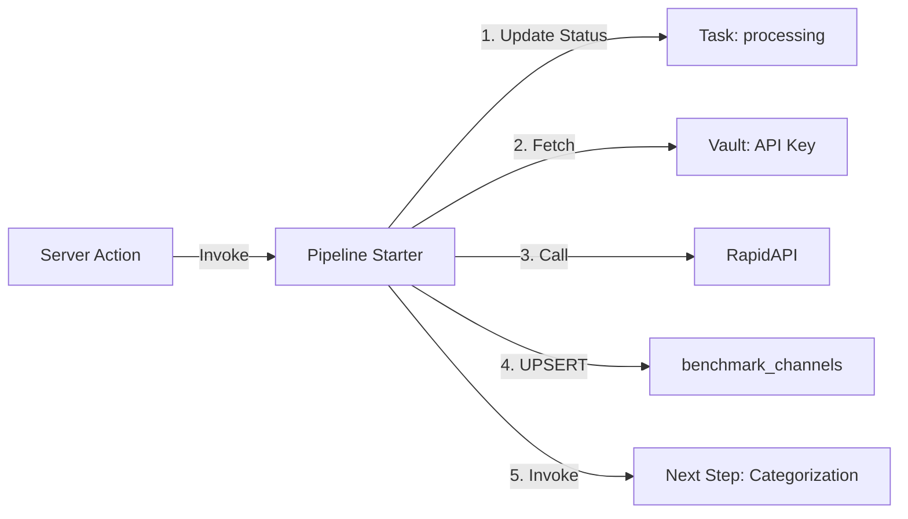

# Enrichment Pipeline Starter - Edge Function

Esta Edge Function é o **ponto de entrada** do pipeline de enriquecimento de canais. Ela busca os dados básicos do canal na RapidAPI e os salva no banco de dados.

## Fluxo de Execução



## Funcionalidades

### 1. Atualização de Status
- Atualiza a task para status `'processing'`
- Define `started_at` timestamp

### 2. Busca de API Key
- Acessa Supabase Vault
- Nome do secret: `rapidapi_key_1760651731629`
- Requer privilégios de admin

### 3. Chamada à RapidAPI

**Endpoint:**
```
GET https://yt-api.p.rapidapi.com/channel/about?id={channelId}
```

**Headers:**
```
X-RapidAPI-Host: yt-api.p.rapidapi.com
X-RapidAPI-Key: {key_from_vault}
```

**Resposta esperada:**
```json
{
  "channelId": "UCxxxxxx",
  "title": "Channel Name",
  "description": "Channel description",
  "subscriberCount": 1000000,
  "viewCount": 50000000,
  "videosCount": 150,
  "joinedDate": "2015-01-15",
  "keywords": ["tech", "review"],
  "country": "US",
  "customUrl": "@channelname",
  "thumbnail": "https://...",
  "banner": "https://..."
}
```

### 4. Padronização de Dados

Mapeamento da API para o schema do banco:

| API Field | Database Field | Transformation |
|-----------|---------------|----------------|
| `channelId` | `channel_id` | Direct |
| `title` | `channel_name` | Direct |
| `description` | `description` | Direct |
| `subscriberCount` | `subscriber_count` | Parse to int |
| `viewCount` | `total_views` | Parse to int |
| `videosCount` | `video_upload_count` | Direct |
| `joinedDate` | `creation_date` | Parse to Date |
| `keywords` | `channel_keywords` | Direct (array) |
| - | `metric_date` | Current date |
| `country` | `country` | Direct |
| `customUrl` | `custom_url` | Direct |
| `thumbnail` | `thumbnail_url` | Direct |
| `banner` | `banner_url` | Direct |

### 5. UPSERT no Banco

```typescript
await supabase
  .from('benchmark_channels')
  .upsert(standardizedData, {
    onConflict: 'channel_id',
    ignoreDuplicates: false,
  })
```

**Comportamento:**
- Se o canal já existe: **atualiza** todos os campos
- Se o canal não existe: **cria** novo registro

### 6. Próximo Passo

Invoca a próxima Edge Function:
```typescript
await supabase.functions.invoke('enrichment-step-1-categorization', {
  body: { channelId, taskId }
})
```

## Input

```typescript
{
  channelId: string  // YouTube Channel ID
  taskId: number     // Task ID para tracking
}
```

## Output

**Sucesso (200):**
```json
{
  "success": true,
  "message": "Pipeline started successfully for channel UCxxxxxx",
  "channelData": {
    "channel_id": "UCxxxxxx",
    "channel_name": "Channel Name",
    "subscriber_count": 1000000
  }
}
```

**Erro (500):**
```json
{
  "success": false,
  "error": "Error message"
}
```

## Variáveis de Ambiente Necessárias

```bash
SUPABASE_URL=https://your-project.supabase.co
SUPABASE_SERVICE_ROLE_KEY=your-service-role-key
```

## Deploy

### Local Testing (Supabase CLI)

```bash
# Start Supabase locally
supabase start

# Serve function locally
supabase functions serve enrichment-pipeline-starter

# Test with curl
curl -i --location --request POST 'http://localhost:54321/functions/v1/enrichment-pipeline-starter' \
  --header 'Authorization: Bearer YOUR_ANON_KEY' \
  --header 'Content-Type: application/json' \
  --data '{"channelId":"UCuAXFkgsw1L7xaCfnd5JJOw","taskId":1}'
```

### Deploy to Supabase

```bash
# Deploy function
supabase functions deploy enrichment-pipeline-starter

# Set secrets
supabase secrets set SUPABASE_SERVICE_ROLE_KEY=your-key
```

## Error Handling

A Edge Function trata os seguintes erros:

1. **Falha ao atualizar task status**
   - Lança erro e interrompe execução

2. **Falha ao buscar API key no Vault**
   - Lança erro com detalhes

3. **Falha na chamada RapidAPI**
   - Verifica status HTTP
   - Lança erro com status code

4. **Falha no UPSERT**
   - Lança erro com mensagem do Supabase

5. **Falha ao invocar próxima função**
   - **NÃO interrompe** execução
   - Apenas loga o erro
   - Task pode ser retentada manualmente

## Próximos Passos

Após esta função, o pipeline continua com:

1. **enrichment-step-1-categorization** (próximo)
   - Categorizar canal com Claude AI
   - Salvar em `benchmark_channels.categorization`

2. **enrichment-step-2-socialblade**
   - Scraping de dados do SocialBlade
   - Salvar em task result

3. **enrichment-step-3-fetch-videos**
   - Buscar vídeos via YouTube Data API
   - Salvar em `benchmark_videos`

4. **enrichment-step-4-baseline-stats**
   - Calcular estatísticas (14d, 30d, 90d)
   - Salvar em `benchmark_channels_baseline_stats`

5. **enrichment-step-5-outlier-analysis**
   - Identificar vídeos outliers
   - Atualizar `benchmark_videos`

## Troubleshooting

### Erro: "Failed to fetch API key from Vault"

- Verifique se o secret existe no Vault
- Nome exato: `rapidapi_key_1760651731629`
- Certifique-se de usar o service role key

### Erro: "RapidAPI request failed: 401"

- API key inválida ou expirada
- Verifique o valor no Vault

### Erro: "RapidAPI request failed: 429"

- Rate limit excedido
- Aguarde e tente novamente
- Considere implementar backoff

### Erro: "Failed to upsert channel data"

- Verifique se a tabela `benchmark_channels` existe
- Confirme que o schema está correto
- Verifique se há constraint violations

## Monitoramento

Para monitorar a execução:

```sql
-- Ver tasks em processing
SELECT * FROM channel_enrichment_tasks
WHERE overall_status = 'processing'
ORDER BY started_at DESC;

-- Ver últimos canais salvos
SELECT channel_id, channel_name, subscriber_count, updated_at
FROM benchmark_channels
ORDER BY updated_at DESC
LIMIT 10;
```

## Logs

Os logs da Edge Function podem ser visualizados em:
- Supabase Dashboard > Edge Functions > Logs
- Ou via CLI: `supabase functions logs enrichment-pipeline-starter`
